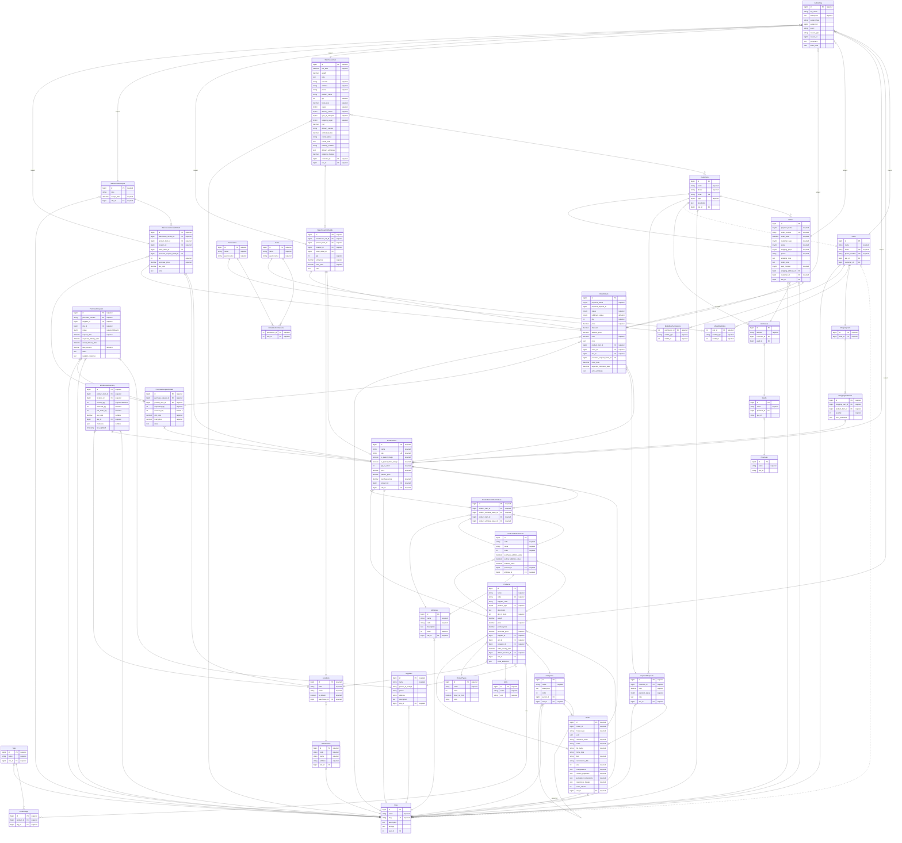

# ER Diagram

```mermaid
---
config:
  theme: mc
  layout: dagre
---
erDiagram
    direction TB
    Customers {
        bigint id PK ""
        string name  "required"
        string phone  "required"
        string email UK ""
        tinyInt type  "required"
        text description  ""
        bigint site_id FK ""
    }

    Addresses {
        bigint id PK ""
        string address  "required"
        bigint customer_id FK ""
        bigint ward_id FK ""
    }

    Wards {
        bigint id PK ""
        string name  "required"
        bigint province_id FK ""
        string gso_id  ""
    }

    Provinces {
        bigint id PK ""
        string name  "required"
        string gso_id  ""
    }

    OrderDetails {
        bigint id PK ""
        tinyInt payment_status  "required"
        bigint payment_request_id  ""
        tinyInt status  "required"
        tinyInt fulfillment_status  "default 0"
        int qty  "required"
        decimal price  "required"
        decimal discount  ""
        decimal addition_price  ""
        decimal total  "required"
        text note  ""
        bigint product_item_id FK "required"
        bigint order_id FK "required"
        bigint site_id FK "required"
        bigint purchase_request_detail_id FK ""
        datetime order_date  ""
        datetime expected_fulfillment_date  ""
        json extra_attributes  ""
    }

    ProductItems {
        bigint id PK "required"
        string name  "required"
        string sku UK "required"
        boolean is_parent_image  "required"
        boolean is_parent_slider_image  "required"
        int qty_in_stock  "required"
        decimal price  "required"
        decimal partner_price  ""
        decimal purchase_price  "required"
        bigint product_id FK "required"
        bigint site_id FK "required"
    }

    Attributes {
        bigint id PK ""
        string name  "required"
        string code  "required"
        text description  ""
        int order "default 0"
        bigint site_id FK "required"
    }

    ProductAttributeValues {
        bigint id PK ""
        string code  "required"
        string value  "required"
        int order  "required"
        decimal purchase_addition_value  ""
        decimal partner_addition_value  ""
        decimal addition_value  ""
        bigint product_id FK "required"
        bigint attribute_id FK "required"
    }

    ProductItemAttributeValues {
        bigint id PK "required"
        bigint product_item_id FK "required"
        bigint product_attribute_value_id FK "required"
    }

    ProductItemAttributeValues {
        bigint product_item_id FK "required"
        bigint product_attribute_value_id FK "required"
    }

    Categories {
        bigint id PK ""
        string name  "required"
        text description  ""
        int order  ""
        bigint parent_id FK ""
        bigint site_id FK "required"
    }

    Tags {
        bigint id PK "required"
        string name  "required"
        bigint site_id FK "required"
    }

    ProductTags {
        bigint id PK "required"
        bigint product_id FK "required"
        bigint tag_id FK "required"
    }

    Orders {
        bigint id PK ""
        tinyInt payment_status  "required"
        string order_number UK "required"
        datetime order_date  "required"
        tinyInt customer_type  "required"
        tinyInt status  "required"
        tinyInt shipping_payer  "required"
        string phone  "required"
        text shipping_note  ""
        text order_note  ""
        tinyInt sale_channel  "required"
        bigint shipping_address_id FK ""
        bigint customer_id FK "required"
        bigint site_id FK ""
    }

    PaymentRequests {
        bigint id PK "required"
        bigint customer_id FK "required"
        decimal total  "required"
        tinyInt payment_status  "required"
        text note  ""
        bigint site_id FK "required"
    }

    PurchaseRequests {
        bigint id PK "required"
        string purchase_number UK "required"
        bigint supplier_id FK "required"
        bigint site_id FK "required"
        tinyInt status "required default 1"
        datetime request_date "required"
        datetime expected_delivery_date ""
        datetime actual_delivery_date ""
        decimal total_amount "default 0"
        text notes ""
        text supplier_response ""
    }

    PurchaseRequestDetails {
        bigint id PK "required"
        bigint purchase_request_id FK "required"
        bigint product_item_id FK "required"
        int requested_qty "required"
        int received_qty "default 0"
        decimal unit_price "required"
        decimal total_price "required"
        text notes ""
    }

    Suppliers {
        bigint id PK "required"
        string name  "required"
        string person_in_charge  ""
        string phone  ""
        string address  ""
        text description  ""
        bigint site_id FK "required"
    }

    Units {
        bigint id PK "required"
        string name  "required"
        string unit  "required"
    }

    ProductTypes {
        bigint id PK "required"
        string name  "required"
        int order  ""
        boolean show_on_front  ""
        string color  ""
    }

    Warehouses {
        bigint id PK "required"
        string code  "required"
        string name  "required"
        string address  "required"
        bigint site_id FK ""
    }

    ShoppingCarts {
        bigint id PK "required"
        bigint user_id FK "required"
    }

    ShoppingCartItems {
        bigint id PK "required"
        bigint shopping_cart_id FK "required"
        bigint product_item_id FK "required"
        int quantity  "required"
        json extra_attributes  ""
    }

    WarehouseOuts {
        bigint id PK "required"
        datetime out_date  "required"
        decimal weight  ""
        text note  ""
        string receiver  "required"
        string address  "required"
        string phone  "required"
        string product_name  ""
        int qty  "required"
        decimal total_price  "required"
        tinyInt status  "required"
        tinyInt delivery_status  "required"
        tinyInt type_of_transport  "required"
        tinyInt shipping_payer  "required"
        decimal cod  ""
        string delivery_service  ""
        decimal estimated_time  ""
        string carrier_status  ""
        text carrier_note  ""
        string tracking_number  ""
        json delivery_attributes  ""
        decimal shipping_charges  ""
        bigint customer_id FK "required"
        bigint site_id FK "required"
    }

    WarehouseOutDetails {
        bigint id PK "required"
        bigint warehouse_out_id FK "required"
        bigint product_item_id FK "required"
        bigint location_id FK "required"
        bigint order_detail_id FK ""
        int qty  "required"
        decimal unit_price  "required"
        decimal total_price  "required"
        text note  ""
    }

    WarehouseReceipts {
        bigint id PK "required"
        string note  ""
        datetime receipt_date  "required"
        bigint site_id FK "required"
    }

    WarehouseReceiptDetails {
        bigint id PK "required"
        bigint warehouse_receipt_id FK "required"
        bigint product_item_id FK "required"
        bigint location_id FK "required"
        bigint order_detail_id FK ""
        bigint purchase_request_detail_id FK ""
        int qty  "required"
        decimal purchase_price  "required"
        decimal fee_price  ""
        text note  ""
    }

    Products {
        bigint id PK ""
        string name  "required"
        string code UK "required"
        string supplier_code  ""
        tinyInt product_type FK "required"
        text description  ""
        int qty_in_stock  "required"
        decimal weight  ""
        decimal price  "required"
        decimal partner_price  ""
        decimal purchase_price  "required"
        bigint supplier_id FK "required"
        bigint unit_id FK "required"
        bigint category_id FK "required"
        datetime order_closing_date  ""
        bigint default_location_id FK "required"
        bigint site_id FK ""
        json extra_attributes  ""
    }

    Media {
        bigint id PK "required"
        bigint model_id  "required"
        string model_type  "required"
        uuid uuid  ""
        string collection_name  "required"
        string name  "required"
        string file_name  "required"
        string mime_type  ""
        string disk  "required"
        string conversions_disk  ""
        int size  "required"
        json manipulations  "required"
        json custom_properties  "required"
        json generated_conversions  "required"
        json responsive_images  "required"
        int order_column  ""
        bigint site_id FK "required"
    }

    Permissions {
        bigint id PK "required"
        string name  "required"
        string guard_name  "required"
    }

    Roles {
        bigint id PK "required"
        string name  "required"
        string guard_name  "required"
    }

    RolesHasPermissions {
        int permission_id FK "required"
        int role_id FK "required"
    }

    ModelHasRoles {
        int role_id FK "required"
        string model_type  "required"
        int model_id  "required"
    }

    ModelHasPermissions {
        int permission_id FK "required"
        string model_type  "required"
        int model_id  "required"
    }

    ActivityLog {
        bigint id PK "required"
        string log_name  ""
        text description  "required"
        string subject_type  ""
        bigint subject_id  ""
        string event  ""
        string causer_type  ""
        bigint causer_id  ""
        json properties  ""
        uuid batch_uuid  ""
    }

    Sites {
        bigint id PK ""
        string name  "required"
        string slug UK "required"
        text description  ""
        json settings  ""
        int user_id FK ""
    }

    Users {
        bigint id PK ""
        string name  "required"
        string email UK "required"
        string phone_number UK "required"
        bigint site_id FK ""
        bigint customer_id FK ""
    }

    Locations {
        bigint id PK "required"
        string code  "required"
        string name  "required"
        boolean is_default  "required"
        bigint warehouse_id FK "required"
    }

    WarehouseInventory {
        bigint id PK "required"
        bigint product_item_id FK "required"
        bigint location_id FK "required"
        int current_qty "required default 0"
        int reserved_qty "default 0"
        int pre_order_qty "default 0"
        decimal avg_cost "nullable"
        bigint site_id FK "required"
        json metadata "nullable"
        timestamp last_updated
    }

    Customers||--o{Orders:"  "
    Orders||--|{OrderDetails:"includes"
    Customers}|--||Sites:"  "
    Products}|--||Sites:"  "
    Warehouses}|--||Sites:"  "
    Orders}|--||Sites:"  "
    Customers||--o{Addresses:"  "
    Addresses}|--||Wards:"  "
    Wards}|--||Provinces:"  "
    Customers|o..||Users:"  "
    Users|o..o|Sites:"  "
    Products||--|{ProductItems:"  "
    OrderDetails}|--||ProductItems:"  "
    Products||--|{ProductAttributeValues:"  "
    ProductItems||--|{ProductItemAttributeValues:"  "
    ProductItemAttributeValues}|--||ProductAttributeValues:"  "
    Attributes||--|{ProductItemAttributeValues:"  "
    Products}o--||Categories:"  "
    Categories||--o{Categories:"parent_of"
    Products||--o{ProductTags:"has"
    Tags||--o{ProductTags:"  "
    Orders}o--||Addresses:"  "
    Orders}o--||Customers:"  "
    PaymentRequests}o--||Customers:"  "
    OrderDetails||--||PaymentRequests:"  "
    PurchaseRequests}|--||Suppliers:"  "
    PurchaseRequests}|--||Sites:"  "
    PurchaseRequests||--|{PurchaseRequestDetails:"  "
    PurchaseRequestDetails}|--||ProductItems:"  "
    OrderDetails}o--||PurchaseRequestDetails:"  "
    Products}o--||Suppliers:"  "
    Products}o--||Units:"  "
    Products}o--||Locations:"  "
    Products}o--||ProductTypes:"  "
    Locations}o--||Warehouses:"  "
    ShoppingCarts||--|{ShoppingCartItems:"  "
    ShoppingCartItems||--||ProductItems:"  "
    Users||--||ShoppingCarts:"  "
    WarehouseOuts}o--o{Customers:"  "
    WarehouseOuts||--|{WarehouseOutDetails:"  "
    WarehouseOutDetails||--||ProductItems:"  "
    WarehouseOutDetails||--||Locations:"  "
    WarehouseOutDetails||--||OrderDetails:"  "
    WarehouseReceipts||--|{WarehouseReceiptDetails:"  "
    WarehouseReceiptDetails||--||ProductItems:"  "
    WarehouseReceiptDetails||--||Locations:"  "
    WarehouseReceiptDetails||--||OrderDetails:"  "
    WarehouseReceiptDetails}o--||PurchaseRequestDetails:"  "
    Products||--|{Media:"  "
    ProductItems||--|{Media:"  "
    Categories||--|{Media:"  "
    PaymentRequests||--|{Media:"  "
    Permissions||--o{RolesHasPermissions:"  "
    Roles||--o{RolesHasPermissions:"  "
    Roles||--o{ModelHasRoles:"  "
    Permissions||--o{ModelHasPermissions:"  "
    Users||--o{ModelHasRoles:"  "
    Users||--o{ModelHasPermissions:"  "
    ActivityLog}o--||Users:"causer"
    ActivityLog}o--||Products:"subject"
    ActivityLog}o--||ProductItems:"subject"
    ActivityLog}o--||Orders:"subject"
    ActivityLog}o--||OrderDetails:"subject"
    ActivityLog}o--||WarehouseOuts:"subject"
    ActivityLog}o--||WarehouseOutDetails:"subject"
    ActivityLog}o--||WarehouseReceipts:"subject"
    ActivityLog}o--||WarehouseReceiptDetails:"subject"
    Orders}|--|{Sites:"  "
    OrderDetails}|--||Sites:"  "
    WarehouseOuts}|--||Sites:"  "
    WarehouseReceipts}|--||Sites:"  "
    Categories}|--||Sites:"  "
    Tags}|--||Sites:"  "
    Suppliers}|--||Sites:"  "
    ProductItems}|--||Sites:"  "
    PaymentRequests}|--||Sites:"  "
    Media}|--||Sites:"  "
    PurchaseRequests}|--||Sites:"  "
    WarehouseInventory}|--||Sites:"  "
    Attributes}|--||Sites:"  "
    WarehouseInventory}|--||ProductItems:"  "
    WarehouseInventory}|--||Locations:"  "
    ProductItemAttributeValues||--||ProductItems:"  "
    ProductItemAttributeValues||--||ProductAttributeValues:"  "
    ProductAttributeValues||--||Products:"  "
    ProductAttributeValues||--||Attributes:"  "
    Users}|--|{Sites:"  "
```
