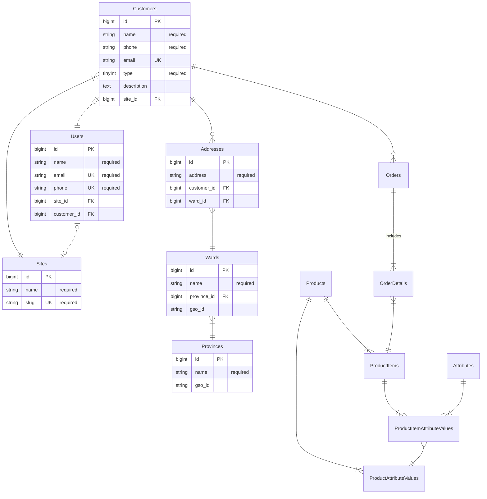

# ER Diagram

```mermaid
---
config:
  theme: mc
  layout: dagre
---
erDiagram
    Customers {
        bigint id PK ""
        string name  "required"
        string phone  "required"
        string email UK ""
        tinyInt type  "required"
        text description  ""
        bigint site_id FK ""
    }

    Addresses {
        bigint id PK ""
        string address  "required"
        bigint customer_id FK ""
        bigint ward_id FK ""
    }

    Sites {
        bigint id PK ""
        string name  "required"
        string slug UK "required"
    }

    Users {
        bigint id PK ""
        string name  "required"
        string email UK "required"
        string phone UK "required"
        bigint site_id FK ""
        bigint customer_id FK ""
    }

    Wards {
        bigint id PK ""
        string name  "required"
        bigint province_id FK ""
        string gso_id  ""
    }

    Provinces {
        bigint id PK ""
        string name  "required"
        string gso_id  ""
    }

    Orders {

    }

    OrderDetails {

    }

    Products {

    }

    ProductItems {

    }

    Attributes {

    }

    ProductAttributeValues {

    }

    ProductItemAttributeValues {

    }

    Customers||--o{Orders:""
    Orders||--|{OrderDetails:"includes"
    Customers}|--||Sites:"  "
    Customers||--o{Addresses:"  "
    Addresses}|--||Wards:"  "
    Wards}|--||Provinces:"  "
    Customers|o..||Users:"  "
    Users|o..o|Sites:"  "
    Products||--|{ProductItems:"  "
    OrderDetails}|--||ProductItems:"  "
    Products||--|{ProductAttributeValues:"  "
    ProductItems||--|{ProductItemAttributeValues:"  "
    ProductItemAttributeValues}|--||ProductAttributeValues:"  "
    Attributes||--|{ProductItemAttributeValues:"  "
```
