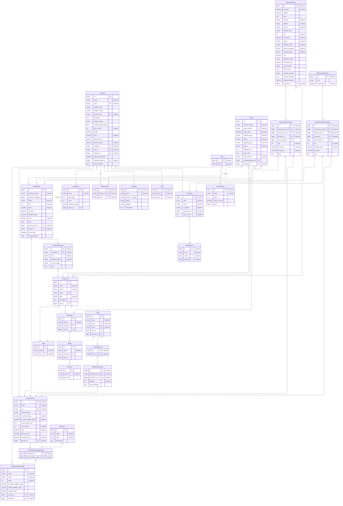

# ER Diagram

```mermaid
---
config:
  theme: mc
  layout: elk
---
erDiagram
	direction TB
	Customers {
		bigint id PK ""  
		string name  "required"  
		string phone  "required"  
		string email UK ""  
		tinyInt type  "required"  
		text description  ""  
		bigint site_id FK ""  
	}

	Addresses {
		bigint id PK ""  
		string address  "required"  
		bigint customer_id FK ""  
		bigint ward_id FK ""  
	}

	Sites {
		bigint id PK ""  
		string name  "required"  
		string slug UK "required"  
	}

	Users {
		bigint id PK ""  
		string name  "required"  
		string email UK "required"  
		string phone UK "required"  
		bigint site_id FK ""  
		bigint customer_id FK ""  
	}

	Wards {
		bigint id PK ""  
		string name  "required"  
		bigint province_id FK ""  
		string gso_id  ""  
	}

	Provinces {
		bigint id PK ""  
		string name  "required"  
		string gso_id  ""  
	}

	OrderDetails {
		bigint id PK ""  
		tinyInt payment_status  "required"  
		bigint payment_request_id  ""  
		tinyInt status  "required"  
		int qty  "required"  
		decimal price  "required"  
		decimal discount  ""  
		decimal addition_price  ""  
		decimal total  "required"  
		text note  ""  
		bigint product_item_id FK "required"  
		bigint order_id FK "required"  
		datetime order_date  ""  
		json extra_attributes  ""  
	}

	Products {
		bigint id PK ""  
		string name  "required"  
		string code UK "required"  
		string supplier_code  ""  
		string supplier_image  ""  
		tinyInt product_type FK "required"  
		text description  ""  
		string product_image  ""  
		json product_images_slider  ""  
		int qty_in_stock  "required"  
		decimal weight  ""  
		decimal price  "required"  
		decimal partner_price  ""  
		decimal purchase_price  "required"  
		bigint supplier_id FK "required"  
		bigint unit_id FK "required"  
		bigint category_id FK "required"  
		datetime order_closing_date  ""  
		bigint default_location_id FK "required"  
		json extra_attributes  ""  
	}

	ProductItems {
		bigint id PK "required"  
		string name  "required"  
		string sku UK "required"  
		string product_image  ""  
		boolean is_parent_image  "required"  
		boolean is_parent_slider_image  "required"  
		json image_slider_value  ""  
		int qty_in_stock  "required"  
		decimal price  "required"  
		decimal partner_price  ""  
		decimal purchase_price  "required"  
		bigint product_id FK "required"  
	}

	Attributes {
		bigint id PK ""  
		string name  "required"  
		string code  "required"  
		text description  ""  
	}

	ProductAttributeValues {
		bigint id PK ""  
		string code  "required"  
		string value  "required"  
		int order  "required"  
		decimal purchase_addition_value  ""  
		decimal partner_addition_value  ""  
		decimal addition_value  ""  
		bigint product_id FK "required"  
		bigint attribute_id FK "required"  
	}

	ProductItemAttributeValues {
		bigint product_item_id FK "required"  
		bigint product_attribute_value_id FK "required"  
	}

	Categories {
		bigint id PK ""  
		string name  "required"  
		text description  ""  
		int order  ""  
		string category_image  ""  
		bigint parent_id FK ""  
	}

	Tags {
		bigint id PK "required"  
		string name  "required"  
	}

	ProductTags {
		bigint id PK "required"  
		bigint product_id FK "required"  
		bigint tag_id FK "required"  
	}

	Orders {
		bigint id PK ""  
		tinyInt payment_status  "required"  
		string order_number UK "required"  
		datetime order_date  "required"  
		tinyInt customer_type  "required"  
		tinyInt status  "required"  
		tinyInt shipping_payer  "required"  
		string phone  "required"  
		text shipping_note  ""  
		text order_note  ""  
		tinyInt sale_channel  "required"  
		bigint shipping_address_id FK ""  
		bigint customer_id FK "required"  
	}

	PaymentRequests {
		bigint id PK "required"  
		bigint customer_id FK "required"  
		decimal total  "required"  
		tinyInt payment_status  "required"  
		string invoice_image  ""  
		text note  ""  
	}

	Suppliers {
		bigint id PK "required"  
		string name  "required"  
		string person_in_charge  ""  
		string phone  ""  
		string address  ""  
		text description  ""  
	}

	Units {
		bigint id PK "required"  
		string name  "required"  
		string unit  "required"  
	}

	Locations {
		bigint id PK "required"  
		string code  "required"  
		string name  "required"  
		boolean is_default  "required"  
		bigint warehouse_id FK "required"  
		int qty_in_stock  "required"  
	}

	ProductTypes {
		bigint id PK "required"  
		string name  "required"  
		int order  ""  
		boolean show_on_front  ""  
		string color  ""  
	}

	Warehouses {
		bigint id PK "required"  
		string code  "required"  
		string name  "required"  
		string address  "required"  
	}

	ShoppingCarts {
		bigint id PK "required"  
		bigint user_id FK "required"  
	}

	ShoppingCartItems {
		bigint id PK "required"  
		bigint shopping_cart_id FK "required"  
		bigint product_item_id FK "required"  
		int quantity  "required"  
		json extra_attributes  ""  
	}

	WarehouseOuts {
		bigint id PK "required"  
		datetime out_date  "required"  
		decimal weight  ""  
		text note  ""  
		string receiver  "required"  
		string address  "required"  
		string phone  "required"  
		string product_name  ""  
		int qty  "required"  
		decimal total_price  "required"  
		tinyInt status  "required"  
		tinyInt delivery_status  "required"  
		tinyInt type_of_transport  "required"  
		tinyInt shipping_payer  "required"  
		decimal cod  ""  
		string delivery_service  ""  
		decimal estimated_time  ""  
		string carrier_status  ""  
		text carrier_note  ""  
		string tracking_number  ""  
		json delivery_attributes  ""  
		decimal shipping_charges  ""  
		bigint customer_id FK "required"  
	}

	WarehouseOutDetails {
		bigint id PK "required"  
		bigint warehouse_out_id FK "required"  
		bigint product_item_id FK "required"  
		bigint location_id FK "required"  
		bigint order_detail_id FK ""  
		int qty  "required"  
		decimal unit_price  "required"  
		decimal total_price  "required"  
		text note  ""  
	}

	WarehouseReceipts {
		bigint id PK "required"  
		string note  ""  
		datetime receipt_date  "required"  
	}

	WarehouseReceiptDetails {
		bigint id PK "required"  
		bigint warehouse_receipt_id FK "required"  
		bigint product_item_id FK "required"  
		bigint location_id FK "required"  
		bigint order_detail_id FK ""  
		int qty  "required"  
		decimal purchase_price  "required"  
		decimal fee_price  ""  
		text note  ""  
	}

	Customers||--o{Orders:"  "
	Orders||--|{OrderDetails:"includes"
	Customers}|--||Sites:"  "
	Customers||--o{Addresses:"  "
	Addresses}|--||Wards:"  "
	Wards}|--||Provinces:"  "
	Customers|o..||Users:"  "
	Users|o..o|Sites:"  "
	Products||--|{ProductItems:"  "
	OrderDetails}|--||ProductItems:"  "
	Products||--|{ProductAttributeValues:"  "
	ProductItems||--|{ProductItemAttributeValues:"  "
	ProductItemAttributeValues}|--||ProductAttributeValues:"  "
	Attributes||--|{ProductItemAttributeValues:"  "
	Products}o--||Categories:"  "
	Categories||--o{Categories:"parent_of"
	Products||--o{ProductTags:"has"
	Tags||--o{ProductTags:"  "
	Orders}o--||Addresses:"  "
	Orders}o--||Customers:"  "
	PaymentRequests}o--||Customers:"  "
	OrderDetails||--||PaymentRequests:"  "
	Products}o--||Suppliers:"  "
	Products}o--||Units:"  "
	Products}o--||Locations:"  "
	Products}o--||ProductTypes:"  "
	Locations}o--||Warehouses:"  "
	ShoppingCarts||--|{ShoppingCartItems:"  "
	ShoppingCartItems||--||ProductItems:"  "
	Users||--||ShoppingCarts:"  "
	WarehouseOuts}o--o{Customers:"  "
	WarehouseOuts||--|{WarehouseOutDetails:"  "
	WarehouseOutDetails||--||ProductItems:"  "
	WarehouseOutDetails||--||Locations:"  "
	WarehouseOutDetails||--||OrderDetails:"  "
	WarehouseReceipts||--|{WarehouseReceiptDetails:"  "
	WarehouseReceiptDetails||--||ProductItems:"  "
	WarehouseReceiptDetails||--||Locations:"  "
	WarehouseReceiptDetails||--||OrderDetails:"  "
```
