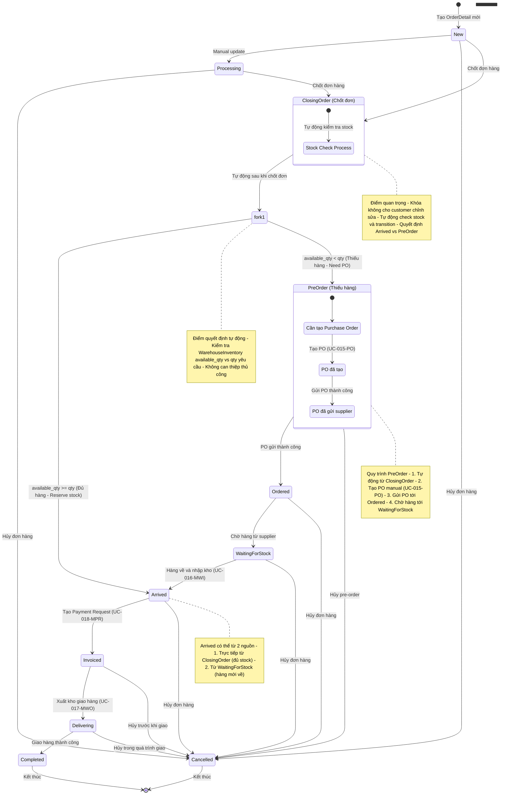

# UC014: Manage Order Details

## Thông tin Use Case

| Thuộc tính      | Nội dung                                   |
|----------------|--------------------------------------------|
| Use Case ID    | UC-014-MOD                                 |
| Tên Use Case   | Quản lý chi tiết đơn hàng                  |
| Actor          | SiteAdmin (người dùng có quyền hạn manage_orders) |
| Mô tả          | Người dùng có thể xem, tìm kiếm, lọc và cập nhật trạng thái chi tiết đơn hàng (OrderDetails) thuộc trang web mà họ sở hữu |
| Độ ưu tiên     | Cao                                        |

---

## Điều kiện

| Loại           | Mô tả                       |
|----------------|----------------------------|
| Pre-condition  | - Người dùng đã đăng nhập - Người dùng có quyền hạn **manage_orders** - Đã có đơn hàng và chi tiết đơn hàng trong hệ thống |
| Post-condition | Chi tiết đơn hàng được xem/cập nhật thành công và thuộc về trang web hiện tại |

---

## Luồng chính (Main Flow)

### Luồng xem danh sách OrderDetails

| Bước | Actor      | Hành động |
|------|------------|-----------|
| 1    | SiteAdmin  | Đăng nhập vào hệ thống |
| 2    | Hệ thống   | Kiểm tra vai trò và quyền sở hữu trang web |
| 3    | Hệ thống   | Hiển thị **"Chi tiết đơn hàng"** trong menu sidebar |
| 4    | SiteAdmin  | Nhấn vào **"Chi tiết đơn hàng"** |
| 5    | Hệ thống   | Hiển thị danh sách OrderDetails thuộc trang web hiện tại |
| 6    | Hệ thống   | Hiển thị các cột: Order Number, Customer, Product, ProductItem, ProductType, Quantity, Price, Status, Payment Status, Order Date |
| 7    | Hệ thống   | Hiển thị bộ lọc và tìm kiếm |

### Luồng tìm kiếm và lọc OrderDetails

| Bước | Actor      | Hành động |
|------|------------|-----------|
| 8    | SiteAdmin  | Nhập từ khóa tìm kiếm (Order Number, Customer Name, Product Name) |
| 9    | Hệ thống   | Tìm kiếm theo từ khóa trong các trường liên quan |
| 10   | Hệ thống   | **Hiển thị danh sách OrderDetails có status = PreOrder** sau khi chốt đơn thiếu hàng |
| 11   | SiteAdmin  | Chọn lọc theo **Product** (dropdown với search) |
| 12   | SiteAdmin  | Chọn lọc theo **ProductItem** (dropdown phụ thuộc Product) |
| 13   | SiteAdmin  | Chọn lọc theo **ProductType** (dropdown list) |
| 14   | SiteAdmin  | Chọn lọc theo **Status** (checkbox multiple selection) |
| 15   | SiteAdmin  | Chọn lọc theo **Payment Status** (checkbox multiple selection) |
| 16   | SiteAdmin  | Chọn lọc theo **Order Date Range** (date picker) |
| 17   | SiteAdmin  | Nhấn nút **"Áp dụng bộ lọc"** |
| 18   | Hệ thống   | Hiển thị kết quả lọc với pagination |
| 19   | Hệ thống   | Hiển thị tổng số lượng kết quả và thống kê theo trạng thái |
| 20   | Hệ thống   | **Hiển thị nút "Tạo phiếu xuất kho"** nếu có OrderDetails với Status=Invoiced và Payment_Status=Paid |

### Luồng xem chi tiết OrderDetail

| Bước | Actor      | Hành động |
|------|------------|-----------|
| 19   | SiteAdmin  | Nhấn vào một OrderDetail để xem chi tiết |
| 20   | Hệ thống   | Hiển thị modal/page chi tiết OrderDetail |
| 21   | Hệ thống   | Hiển thị thông tin: Order info, Customer info, Product details, Pricing, Status history, Notes |
| 22   | Hệ thống   | Hiển thị nút **"Cập nhật trạng thái"** nếu có quyền |

### Luồng cập nhật trạng thái OrderDetail

| Bước | Actor      | Hành động |
|------|------------|-----------|
| 23   | SiteAdmin  | Nhấn nút **"Cập nhật trạng thái"** |
| 24   | Hệ thống   | Hiển thị dropdown trạng thái (chỉ các trạng thái hợp lệ) |
| 25   | SiteAdmin  | Chọn trạng thái mới |
| 26   | SiteAdmin  | Nhập ghi chú thay đổi (tùy chọn) |
| 27   | SiteAdmin  | Nhấn nút **"Xác nhận cập nhật"** |
| 28   | Hệ thống   | Validate trạng thái transition hợp lệ |
| 29   | Hệ thống   | Cập nhật trạng thái OrderDetail |
| 30   | Hệ thống   | **Tự động tính toán và cập nhật Order status** theo quy tắc đồng bộ |
| 31   | Hệ thống   | Cập nhật WarehouseInventory nếu cần thiết |
| 32   | Hệ thống   | Ghi log thay đổi trạng thái |
| 33   | Hệ thống   | Thông báo cập nhật thành công |
| 34   | Hệ thống   | Refresh danh sách để hiển thị thay đổi |

### Luồng bulk update trạng thái

| Bước | Actor      | Hành động |
|------|------------|-----------|
| 35   | SiteAdmin  | Chọn multiple OrderDetails bằng checkbox |
| 36   | SiteAdmin  | Nhấn nút **"Cập nhật hàng loạt"** |
| 37   | Hệ thống   | Hiển thị modal bulk update |
| 38   | SiteAdmin  | Chọn trạng thái mới cho tất cả items được chọn |
| 39   | SiteAdmin  | Nhập ghi chú chung |
| 40   | SiteAdmin  | Nhấn nút **"Xác nhận cập nhật hàng loạt"** |
| 41   | Hệ thống   | Validate từng OrderDetail có thể chuyển trạng thái |
| 42   | Hệ thống   | Cập nhật từng OrderDetail hợp lệ |
| 43   | Hệ thống   | **Tự động cập nhật Order status** cho các đơn hàng bị ảnh hưởng |
| 44   | Hệ thống   | Hiển thị báo cáo kết quả: Success/Failed với lý do |

### Luồng cập nhật payment status

| Bước | Actor      | Hành động |
|------|------------|-----------|
| 45   | SiteAdmin  | Nhấn **"Cập nhật thanh toán"** trên OrderDetail |
| 46   | Hệ thống   | Hiển thị dropdown payment status hợp lệ |
| 47   | SiteAdmin  | Chọn payment status mới |
| 48   | SiteAdmin  | Nhập ghi chú về thanh toán (tùy chọn) |
| 49   | SiteAdmin  | Nhấn **"Xác nhận"** |
| 50   | Hệ thống   | Cập nhật OrderDetails.payment_status |
| 51   | Hệ thống   | Ghi log thay đổi payment status |
| 52   | Hệ thống   | Refresh danh sách và highlight thay đổi |

### Luồng tạo phiếu xuất kho từ OrderDetails (UC-017-MWO Integration)

| Bước | Actor      | Hành động |
|------|------------|-----------|
| 53   | SiteAdmin  | Áp dụng filter: Customer, Status = Invoiced, Payment_Status = Paid |
| 54   | Hệ thống   | Hiển thị danh sách OrderDetails đủ điều kiện xuất kho |
| 55   | SiteAdmin  | Chọn multiple OrderDetails bằng checkbox |
| 56   | SiteAdmin  | Nhấn **"Tạo phiếu xuất kho"** từ bulk actions |
| 57   | Hệ thống   | **Validate tất cả OrderDetails** đủ điều kiện xuất |
| 58   | Hệ thống   | **Group OrderDetails theo Customer** |
| 59   | Hệ thống   | **Kiểm tra available stock** cho tất cả ProductItems |
| 60   | Hệ thống   | Hiển thị preview phiếu xuất theo từng Customer |
| 61   | Hệ thống   | **Auto-fill thông tin** Customer, Address, Phone từ Orders |
| 62   | Hệ thống   | **Auto-select location** dựa trên available stock |
| 63   | SiteAdmin  | Review và điều chỉnh thông tin nếu cần |
| 64   | SiteAdmin  | Nhấn **"Xác nhận tạo phiếu xuất"** |
| 65   | Hệ thống   | **Chuyển sang UC-017-MWO**: Tạo WarehouseOut |
| 66   | Hệ thống   | **Liên kết WarehouseOutDetails** với OrderDetails |
| 67   | Hệ thống   | **Cập nhật OrderDetails.status**: Invoiced → Delivering |
| 68   | Hệ thống   | **Cập nhật Order.status** nếu tất cả OrderDetails → Delivering |
| 69   | Hệ thống   | **Thông báo customers** về việc hàng đã xuất kho |
| 70   | Hệ thống   | Hiển thị summary kết quả tạo phiếu xuất |
| 71   | Hệ thống   | **Link đến UC-017-MWO** để theo dõi giao hàng |

### Luồng tạo Payment Request từ OrderDetails (UC-018-MPR Integration)

| Bước | Actor      | Hành động |
|------|------------|-----------|
| 72   | SiteAdmin  | Áp dụng filter: Status = Arrived (7), chưa có payment_request_detail_id |
| 73   | Hệ thống   | Hiển thị danh sách OrderDetails đủ điều kiện tạo payment request |
| 74   | Hệ thống   | **Hiển thị nút "Tạo yêu cầu thanh toán"** khi có OrderDetails eligible |
| 75   | SiteAdmin  | Chọn multiple OrderDetails bằng checkbox |
| 76   | SiteAdmin  | Nhấn **"Tạo yêu cầu thanh toán"** từ bulk actions |
| 77   | Hệ thống   | **Validate tất cả OrderDetails** có status = Arrived và chưa có payment request |
| 78   | Hệ thống   | **Group OrderDetails theo Customer** |
| 79   | Hệ thống   | Hiển thị preview PaymentRequest cho từng Customer: |
|      |            | - Customer info và contact details |
|      |            | - Danh sách OrderDetails và tổng tiền |
|      |            | - Payment due date (mặc định +30 ngày) |
| 80   | SiteAdmin  | Review và điều chỉnh thông tin nếu cần |
| 81   | SiteAdmin  | Nhấn **"Xác nhận tạo yêu cầu thanh toán"** |
| 82   | Hệ thống   | **Chuyển sang UC-018-MPR**: Tạo PaymentRequest và PaymentRequestDetails |
| 83   | Hệ thống   | **Cập nhật PaymentRequest.status**: PaymentRequested |
| 84   | Hệ thống   | **Liên kết OrderDetails** với PaymentRequestDetails (payment_request_detail_id) |
| 85   | Hệ thống   | **Cập nhật OrderDetails.payment_status**: Unpaid → PaymentRequested |
| 86   | Hệ thống   | **Gửi notification** đến customers về payment request |
| 87   | Hệ thống   | **Cập nhật PaymentRequest.status**: PaymentRequested → Processing |
| 88   | Hệ thống   | Hiển thị summary kết quả tạo payment request |
| 89   | Hệ thống   | **Link đến UC-018-MPR** để quản lý payment requests

---

## Luồng thay thế / Ngoại lệ

| Mã   | Điều kiện                    | Kết quả                       |
|------|------------------------------|-------------------------------|
| AF-01| Không có quyền **manage_orders** | Không hiển thị menu Chi tiết đơn hàng |
| AF-02| OrderDetail status = Completed (10) hoặc Cancelled (11) | Chỉ cho phép xem, không cập nhật |
| AF-03| Chuyển trạng thái không hợp lệ | Hiển thị lỗi và danh sách trạng thái được phép |
| AF-04| Không có kết quả tìm kiếm/lọc | Hiển thị thông báo "Không có dữ liệu" |
| AF-05| Lỗi cập nhật trạng thái | Hiển thị lỗi chi tiết và rollback |
| AF-06| Bulk update một phần thất bại | Hiển thị báo cáo chi tiết success/failed |
| AF-07| OrderDetail thuộc Order đã Completed/Cancelled | Không cho phép cập nhật |
| AF-08| Cập nhật đồng thời (concurrent update) | Hiển thị cảnh báo conflict và yêu cầu refresh |
| AF-09| Payment status transition không hợp lệ | Hiển thị lỗi và các trạng thái được phép |
| AF-10| OrderDetail không đủ điều kiện xuất kho | Không hiển thị checkbox selection |
| AF-11| Không đủ available stock để xuất | Hiển thị cảnh báo thiếu hàng và số lượng available |
| AF-12| Mixed customers trong selection | Tự động group và tạo nhiều phiếu xuất riêng |
| AF-13| Customer không có địa chỉ giao hàng | Yêu cầu nhập địa chỉ manual trước khi xuất |
| AF-14| Location không có hàng | Auto-select location khác có stock |
| AF-15| Warehouse out creation failed | Rollback và hiển thị lỗi chi tiết |
| AF-16| OrderDetail không đủ điều kiện payment request | Không hiển thị checkbox (status ≠ Arrived hoặc đã có payment_request_detail_id) |
| AF-17| OrderDetail đã có PaymentRequestDetail | Hiển thị link đến existing PaymentRequest |
| AF-18| Customer không có contact info | Yêu cầu cập nhật customer info trước khi tạo payment request |
| AF-19| Mixed customers trong payment selection | Tự động group và tạo nhiều PaymentRequests riêng |
| AF-20| Payment request creation failed | Rollback và hiển thị lỗi chi tiết |

---

## Dữ liệu hiển thị và tìm kiếm

### Dữ liệu hiển thị trong danh sách
- **ID**: OrderDetail ID
- **Order Number**: Số đơn hàng (link đến Order detail)
- **Order Date**: Ngày đơn hàng
- **Customer**: Tên khách hàng
- **Product**: Tên sản phẩm
- **ProductItem**: SKU/Tên variant
- **ProductType**: Loại sản phẩm (với color coding)
- **Quantity**: Số lượng
- **Price**: Giá bán
- **Discount**: Chiết khấu
- **Total**: Thành tiền
- **Status**: Trạng thái hiện tại (với badge màu)
- **Payment Status**: Trạng thái thanh toán (với badge màu)
- **Payment Request**: Link đến PaymentRequest nếu có
- **Warehouse Out**: Link đến phiếu xuất kho nếu đã xuất
- **Last Updated**: Thời gian cập nhật cuối

### Tiêu chí tìm kiếm và lọc
#### **Tìm kiếm text (global search)**
- Order Number
- Customer Name
- Product Name
- ProductItem SKU/Name
- Order Note

#### **Bộ lọc (Filters)**
- **Customer**: Dropdown với search autocomplete
- **Product**: Dropdown với search autocomplete
- **ProductItem**: Cascade dropdown phụ thuộc Product
- **ProductType**: Multi-select dropdown với color indicator
- **Status**: Multi-select với badge preview
- **Payment Status**: Multi-select với badge preview
- **Payment Request Eligible**: Checkbox (Status=Arrived AND payment_request_detail_id IS NULL)
- **Has Payment Request**: Checkbox (có payment_request_detail_id)
- **Warehouse Out Eligible**: Checkbox (Status=Invoiced AND Payment_Status=Paid)
- **Order Date Range**: Date picker (from - to)
- **Price Range**: Number input (min - max)
- **Quantity Range**: Number input (min - max)

### Export và báo cáo
- **Export Excel**: Xuất kết quả lọc ra Excel
- **Export PDF**: Báo cáo PDF với charts
- **Quick Stats**: Thống kê nhanh theo trạng thái, khách hàng, sản phẩm

---

## Trạng thái và quy tắc chuyển đổi

### ENUM Status Values (1-12) - Giống UC-008-MO
| Value | Status | Vietnamese | Transition Rules |
|-------|--------|------------|------------------|
| 1 | New | Tạo mới | → 2, 3, 12 |
| 2 | Processing | Đang xử lý | → 3, 4, 12 |
| 3 | ClosingOrder | Chốt đơn | → 4, 12 |
| 4 | AddToCart | Thêm giỏ hàng | → 5, 12 |
| 5 | Ordered | Đã order | → 6, 7, 12 |
| 6 | PreOrder | Pre-order | → 7, 12 |
| 7 | WaitingForStock | Chờ nhập kho | → 8, 12 |
| 8 | Arrived | Hàng về | → 9, 12 |
| 9 | Invoiced | Đã báo đơn | → 10, 12 |
| 10 | Delivering | Đang giao hàng | → 11, 12 |
| 11 | Completed | Hoàn thành | No transition (final) |
| 12 | Cancelled | Huỷ | No transition (final) |

### Business Rules cho Status Transition
- **Forward only**: Chỉ cho phép chuyển tiến (trừ Cancelled)
- **Skip allowed**: Có thể bỏ qua một số trạng thái trung gian
- **ClosingOrder trigger**: Status 3 (ClosingOrder) là điểm khóa đơn hàng, tự động trigger stock check
- **Auto-transition từ ClosingOrder**: Tự động chuyển sang Arrived (8) nếu đủ hàng, PreOrder (6) nếu thiếu hàng
- **PreOrder logic**: Chỉ xảy ra từ ClosingOrder khi available_qty < qty, cần tạo PO trước khi chuyển sang Ordered (5)
- **WaitingForStock logic**: Status 7 khi hàng về từ supplier, chờ nhập kho trước khi thành Arrived (8)
- **Inventory impact**: Status 5, 8, 10, 12 ảnh hưởng đến WarehouseInventory
- **Final status**: Status 11, 12 không thể thay đổi

### ENUM Payment Status Values (1-5)
| Value | Status | Vietnamese | Description |
|-------|--------|------------|-------------|
| 1 | Unpaid | Chưa thanh toán | Chưa có yêu cầu thanh toán |
| 2 | PaymentRequested | Yêu cầu thanh toán | Đã gửi yêu cầu thanh toán cho khách |
| 3 | Paid | Đã thanh toán | Khách hàng đã thanh toán |
| 4 | Processing | Đang xử lý | Đang xử lý thanh toán |
| 5 | PendingConfirmation | Chờ xác nhận | Chờ xác nhận thanh toán |

### Business Rules cho Payment Status
- **Status progression**: Unpaid → PaymentRequested → Processing/PendingConfirmation → Paid
- **Warehouse Out eligibility**: Status = Invoiced AND Payment_Status = Paid
- **Payment tracking**: Log tất cả thay đổi payment status
- **Customer notification**: Thông báo khi payment status thay đổi

---

## Sơ đồ trình tự (Sequence Diagram) - Complete OrderDetail Lifecycle

```mermaid
sequenceDiagram
    participant SA as SiteAdmin
    participant UI as Frontend UI
    participant BE as Backend System
    participant DB as Database
    participant INV as WarehouseInventory
    participant LOG as AuditLog
    participant NOTI as Notification
    participant EXT as External Systems
    participant CUST as Customer

    Note over SA,CUST: Complete OrderDetail Lifecycle: New → Completed

    %% Phase 1: Order Creation and Initial Processing
    rect rgb(240, 248, 255)
        Note over SA,DB: Phase 1: Tạo đơn hàng và xử lý ban đầu
        SA->>UI: Tạo OrderDetail mới
        UI->>BE: POST /order-details
        BE->>DB: Create OrderDetail.status = New (1)
        BE->>LOG: Log tạo OrderDetail mới
        BE-->>UI: Return OrderDetail created
        UI-->>SA: Hiển thị OrderDetail.status = New (1)

        SA->>UI: Cập nhật sang "Đang xử lý"
        UI->>BE: PATCH /order-details/{id}/status = Processing (2)
        BE->>DB: Update OrderDetail.status = Processing (2)
        BE->>LOG: Log chuyển New → Processing
        BE-->>UI: Status updated successfully
        UI-->>SA: Hiển thị OrderDetail.status = Processing (2)
    end

    %% Phase 2: Closing Order - Critical Decision Point
    rect rgb(255, 248, 220)
        Note over SA,NOTI: Phase 2: Chốt đơn - Điểm quyết định quan trọng
        SA->>UI: Chọn "Chốt đơn hàng"
        UI->>BE: PATCH /order-details/{id}/status = ClosingOrder (3)
        
        BE->>DB: Validate OrderDetail có thể chốt đơn
        BE->>BE: Check permission (manage_orders)
        BE->>DB: Update OrderDetail.status = ClosingOrder (3)
        BE->>LOG: Log chuyển Processing → ClosingOrder
        
        Note over BE,INV: Tự động kiểm tra stock và quyết định trạng thái tiếp theo
        BE->>INV: Kiểm tra available_qty cho ProductItem
        INV-->>BE: Return stock availability
        
        alt Đủ hàng (available_qty >= qty)
            BE->>DB: Update OrderDetail.status = Arrived (8)
            BE->>INV: Update reserved_qty += qty, available_qty -= qty
            BE->>NOTI: Thông báo customer hàng sẵn sàng
            Note over BE: Direct path: ClosingOrder → Arrived (skip pre-order)
        else Không đủ hàng (available_qty < qty)
            BE->>DB: Update OrderDetail.status = PreOrder (6)
            BE->>INV: Update pre_order_qty += qty
            BE->>NOTI: Thông báo customer về pre-order
            Note over BE: Pre-order path: cần tạo Purchase Order
        end
    end

    %% Phase 3A: Pre-Order Path (nếu thiếu hàng)
    rect rgb(255, 245, 245)
        Note over SA,EXT: Phase 3A: Pre-Order Path - Đặt hàng nhà cung cấp
        
        opt Nếu PreOrder (6)
            SA->>UI: Tạo Purchase Order (UC-015-PO)
            UI->>BE: Create Purchase Order cho ProductItems thiếu
            BE->>EXT: Gửi PO cho Supplier
            
            alt PO gửi thành công
                BE->>DB: Update OrderDetail.status = Ordered (5)
                BE->>LOG: Log chuyển PreOrder → Ordered
                BE->>NOTI: Thông báo customer PO đã gửi
                
                Note over EXT: Supplier xử lý đơn hàng và giao hàng
                EXT-->>BE: Thông báo hàng đã giao
                BE->>DB: Update OrderDetail.status = WaitingForStock (7)
                BE->>LOG: Log chuyển Ordered → WaitingForStock
                
                Note over SA: Kiểm tra hàng về và nhập kho (UC-016-MWI)
                SA->>UI: Xác nhận hàng về và nhập kho
                UI->>BE: Warehouse receipt confirmation
                BE->>DB: Update OrderDetail.status = Arrived (8)
                BE->>INV: Update available_qty += qty, pre_order_qty -= qty
                BE->>LOG: Log chuyển WaitingForStock → Arrived
                BE->>NOTI: Thông báo customer hàng đã về
            end
        end
    end

    %% Phase 4: Payment Request and Invoicing
    rect rgb(245, 255, 245)
        Note over SA,CUST: Phase 4: Yêu cầu thanh toán và lập hóa đơn
        
        Note over SA: OrderDetail.status = Arrived (8) từ path A hoặc B
        SA->>UI: Tạo Payment Request (UC-018-MPR)
        UI->>BE: Create PaymentRequest for eligible OrderDetails
        BE->>DB: Create PaymentRequest và PaymentRequestDetails
        BE->>DB: Update PaymentRequest.status = PaymentRequested
        BE->>DB: Link OrderDetails với PaymentRequestDetails
        BE->>DB: Update OrderDetail.status = Invoiced (9)
        BE->>DB: Update OrderDetail.payment_status = PaymentRequested (2)
        BE->>LOG: Log chuyển Arrived → Invoiced và tạo PaymentRequest
        
        Note over BE: Gửi payment request cho customer
        BE->>NOTI: Gửi payment request cho customer
        BE->>DB: Update PaymentRequest.status = Processing
        BE->>LOG: Log PaymentRequest status: PaymentRequested → Processing
        NOTI->>CUST: Email/SMS payment request
        
        Note over CUST: Customer thực hiện thanh toán
        CUST->>EXT: Payment via gateway/transfer
        EXT-->>BE: Payment confirmation webhook
        BE->>DB: Update OrderDetail.payment_status = Paid (3)
        BE->>LOG: Log payment status change
        BE->>NOTI: Thông báo payment successful
    end

    %% Phase 5: Warehouse Out and Delivery
    rect rgb(255, 250, 240)
        Note over SA,CUST: Phase 5: Xuất kho và giao hàng
        
        Note over SA: OrderDetails với status=Invoiced và payment_status=Paid
        SA->>UI: Tạo phiếu xuất kho (UC-017-MWO)
        UI->>BE: Create WarehouseOut for paid OrderDetails
        BE->>DB: Validate stock availability
        BE->>INV: Check available_qty >= reserved_qty
        BE->>DB: Create WarehouseOut và WarehouseOutDetails
        BE->>DB: Update OrderDetail.status = Delivering (10)
        BE->>INV: Update reserved_qty -= qty, available_qty không thay đổi
        BE->>LOG: Log chuyển Invoiced → Delivering
        BE->>NOTI: Thông báo customer hàng đã xuất kho
        
        Note over EXT: Logistics/Delivery service
        EXT->>CUST: Giao hàng đến customer
        CUST-->>EXT: Xác nhận nhận hàng
        EXT-->>BE: Delivery confirmation
        BE->>DB: Update OrderDetail.status = Completed (11)
        BE->>LOG: Log chuyển Delivering → Completed
        BE->>NOTI: Thông báo delivery completed
    end

    %% Final Status Update
    rect rgb(240, 255, 240)
        Note over SA,CUST: Final: Order hoàn thành
        BE->>DB: Check tất cả OrderDetails của Order
        BE->>DB: Update Order.status = Completed nếu tất cả OrderDetails completed
        BE->>LOG: Log Order completion
        BE-->>UI: Final status update
        UI-->>SA: Hiển thị OrderDetail.status = Completed (11)
        Note over SA,CUST: OrderDetail lifecycle hoàn thành ✅
    end

    %% Error/Cancellation handling
    rect rgb(255, 240, 240)
        Note over SA,CUST: Exception: Hủy đơn hàng (có thể xảy ra ở bất kỳ giai đoạn nào)
        opt Cancellation at any stage
            SA->>UI: Hủy OrderDetail
            UI->>BE: PATCH /order-details/{id}/status = Cancelled (12)
            BE->>DB: Update OrderDetail.status = Cancelled (12)
            BE->>INV: Rollback inventory changes (reserved_qty, pre_order_qty)
            BE->>LOG: Log cancellation với reason
            BE->>NOTI: Thông báo customer về cancellation
            BE-->>UI: Cancellation completed
            Note over SA,CUST: OrderDetail cancelled ❌
        end
    end
```

---

## Sơ đồ trạng thái (State Diagram) - OrderDetail Status Transitions

---

## Sơ đồ luồng nghiệp vụ PreOrder (Business Process Flow)

```mermaid
flowchart TD
    A[Tạo OrderDetail mới] --> B[Status = New]
    B --> C[User chọn 'Chốt đơn']
    C --> D[Status = ClosingOrder<br>Khóa không cho customer sửa]

    D --> E{Tự động kiểm tra Stock}

    E -->|available_qty >= qty| F[Status = Arrived<br>Reserve Stock]
    E -->|available_qty < qty| G[Status = PreOrder<br>Update pre_order_qty]

    F --> H[Cập nhật WarehouseInventory<br>reserved_qty += qty<br>available_qty -= qty]
    H --> I[Thông báo Customer <br> Hàng sẵn sàng]
    I --> J[Sẵn sàng tạo Payment Request<br>UC-018-MPR]

    G --> K[Thông báo Customer<br>về Pre-order]
    K --> L[User tạo Purchase Order<br>UC-015-PO]
    L --> M{PO Status}

    M -->|PO Draft/Pending| L
    M -->|PO Sent Success| N[Status = Ordered<br>Đã gửi supplier]

    N --> O[Chờ hàng từ Supplier]
    O --> P{Hàng về từ Supplier?}
    P -->|Chưa| O
    P -->|Có| Q[Status = WaitingForStock<br>Cần kiểm tra hàng]

    Q --> R[Nhập kho UC-016-MWI<br>Kiểm tra chất lượng]
    R --> S[Status = Arrived<br>Hàng đã về và ok]

    S --> T[Cập nhật WarehouseInventory<br>available_qty += qty<br>pre_order_qty -= qty]
    T --> U[Thông báo Customer<br>Hàng đã sẵn sàng]

    J --> V[Tạo Payment Request<br>UC-018-MPR]
    U --> V

    V --> V1[PaymentRequest.status = PaymentRequested<br>OrderDetail.status = Invoiced<br>OrderDetail.payment_status = PaymentRequested]
    V1 --> V2[Gửi payment request cho customer<br>PaymentRequest.status = Processing]
    V2 --> W[Chờ customer thanh toán<br>PaymentRequest.status = Processing]
    W --> X{Customer thanh toán?}
    X -->|Chưa| W
    X -->|Có| Y[PaymentRequest.status = Paid<br>payment_status = Paid]

    Y --> Z[Xuất kho UC-017-MWO<br>Status = Delivering]
    Z --> AA[Status = Completed]

    style D fill:#ff9800,stroke:#e65100,stroke-width:3px
    style E fill:#ffeb3b,stroke:#f57f17,stroke-width:3px
    style G fill:#f44336,stroke:#d32f2f,stroke-width:2px
    style F fill:#4caf50,stroke:#388e3c,stroke-width:2px
    style L fill:#9c27b0,stroke:#7b1fa2,stroke-width:2px
    style Q fill:#2196f3,stroke:#1976d2,stroke-width:2px

    classDef critical fill:#ffcdd2,stroke:#d32f2f,stroke-width:2px
    classDef success fill:#c8e6c9,stroke:#388e3c,stroke-width:2px
    classDef process fill:#e1bee7,stroke:#7b1fa2,stroke-width:2px

    class G,L,Q critical
    class F,S,Y success
    class D,E,V process
```

---

## Quy tắc nghiệp vụ

| ID    | Quy tắc                                                                               |
|-------|---------------------------------------------------------------------------------------|
| BR-01 | Chỉ hiển thị OrderDetails thuộc site hiện tại (site_id isolation)                   |
| BR-02 | Kiểm tra quyền **manage_orders** trước khi cho phép cập nhật                         |
| BR-03 | Status transition phải tuân theo quy tắc chuyển đổi hợp lệ                          |
| BR-04 | Tự động cập nhật Order status khi OrderDetail status thay đổi                       |
| BR-05 | Ghi log chi tiết mọi thay đổi trạng thái (ai, khi nào, từ trạng thái nào sang trạng thái nào) |
| BR-06 | Cập nhật WarehouseInventory khi OrderDetail chuyển sang trạng thái ảnh hưởng stock  |
| BR-07 | Không cho phép cập nhật OrderDetail khi status = 11 (Completed) hoặc 12 (Cancelled)|
| BR-08 | Bulk update chỉ áp dụng cho các OrderDetail có thể chuyển trạng thái hợp lệ         |
| BR-09 | Hiển thị warning khi cập nhật OrderDetail có thể ảnh hưởng đến Order status        |
| BR-10 | Pagination và lazy loading cho danh sách lớn (>1000 items)                         |
| BR-11 | Cache kết quả lọc trong session để improve performance                               |
| BR-12 | Real-time update khi có thay đổi từ user khác (WebSocket/Server-Sent Events)        |
| BR-13 | **Payment status transition** phải tuân theo quy tắc progression hợp lệ             |
| BR-14 | **Warehouse out eligibility**: Status = Invoiced AND Payment_Status = Paid         |
| BR-15 | **Auto-group by Customer** khi tạo warehouse out từ multiple OrderDetails          |
| BR-16 | **Stock validation** trước khi cho phép tạo warehouse out                          |
| BR-17 | **Auto-update OrderDetails status**: Invoiced → Delivering khi xuất kho            |
| BR-18 | **Liên kết WarehouseOutDetails** với OrderDetails để tracking                      |
| BR-19 | **Notification customers** khi OrderDetails được xuất kho                          |
| BR-20 | **Payment audit trail**: Log đầy đủ payment status changes với timestamp          |
| BR-21 | **Payment request eligibility**: Status = Arrived AND payment_request_detail_id IS NULL |
| BR-22 | **One-to-one relationship**: OrderDetail chỉ có thể thuộc một PaymentRequestDetail |
| BR-23 | **Auto-group by Customer** khi tạo payment request từ multiple OrderDetails       |
| BR-24 | **PaymentRequestDetail linking**: OrderDetails.payment_request_detail_id links to PaymentRequestDetails |
| BR-25 | **Customer notification**: Thông báo khi OrderDetails được include vào PaymentRequest |
| BR-26 | **Payment request validation**: Validate customer info trước khi tạo payment request |
| BR-27 | **PaymentRequest status flow**: PaymentRequested (sau khi tạo) → Processing (sau khi gửi customer) → Paid (khi customer thanh toán) |

---

## UI/UX Requirements

### Danh sách OrderDetails
- **Responsive table**: Mobile-friendly với collapse columns
- **Sticky header**: Header cố định khi scroll
- **Status badges**: Color-coded status indicators
- **Quick actions**: Inline buttons cho common actions
- **Bulk selection**: Checkbox với select all/none
- **Sorting**: Click column header để sort
- **Advanced filters**: Collapsible filter panel

### Chi tiết OrderDetail
- **Modal/Side panel**: Không reload trang
- **Status timeline**: Visual timeline của status changes
- **Related info**: Links đến Order, Customer, Product
- **Audit log**: Lịch sử thay đổi với user và timestamp
- **Quick update**: Dropdown status với shortcut keys

### Performance & UX
- **Loading states**: Skeleton screens, progress bars
- **Error handling**: Friendly error messages với actions
- **Keyboard shortcuts**: Alt+N (New), Ctrl+F (Filter), etc.
- **Auto-save**: Tự động lưu filter preferences
- **Breadcrumbs**: Navigation trail
- **Help tooltips**: Context-sensitive help

### Payment Request Integration
- **Eligibility indicators**: Visual indicators cho OrderDetails eligible for payment requests
- **Customer grouping preview**: Show how OrderDetails will be grouped by customer
- **Payment request status**: Display links to existing PaymentRequests
- **Bulk actions UI**: Clear indication of payment request vs warehouse out actions
- **Integration navigation**: Seamless navigation to UC-018-MPR payment management
